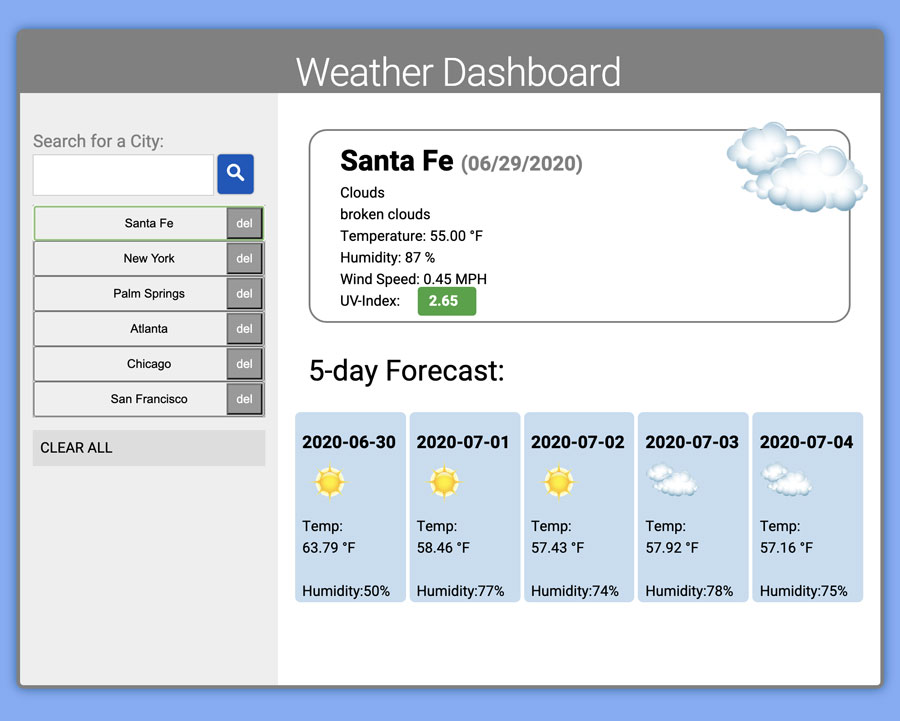

# weather-dashboard
gives the current weather data and 5 day forecast for any city




## Features
1. gives the current weather data and 5 day forecast for any city
2. keeps a locally stored list of cities that were searched for
3. displays visual icons that describe the weather conditions
4. displays a color-coding for UV index rating
5. displays a 5 day forecast for each city

## Server-Side APIs:

This app uses the [OpenWeather API](https://openweathermap.org/api) to retrieve weather data, forecast data and UV-index data for cities. It uses 3 different endpoints to accomplish this.


## User Story

```
AS A traveler
I WANT to see the weather outlook for multiple cities
SO THAT I can plan a trip accordingly
```

## Functionality

```
GIVEN a weather dashboard with form inputs
WHEN I search for a city
THEN I am presented with current and future conditions for that city and that city is added to the search history
WHEN I view current weather conditions for that city
THEN I am presented with the city name, the date, an icon representation of weather conditions, the temperature, the humidity, the wind speed, and the UV index
WHEN I view the UV index
THEN I am presented with a color that indicates whether the conditions are favorable, moderate, or severe
WHEN I view future weather conditions for that city
THEN I am presented with a 5-day forecast that displays the date, an icon representation of weather conditions, the temperature, and the humidity
WHEN I click on a city in the search history
THEN I am again presented with current and future conditions for that city
```

